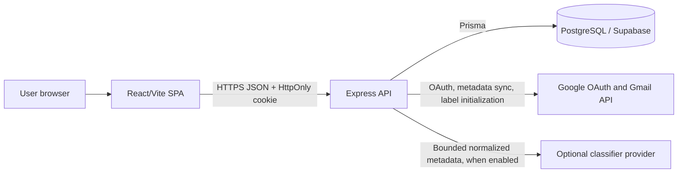
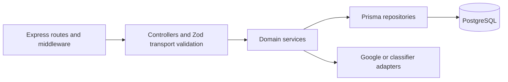
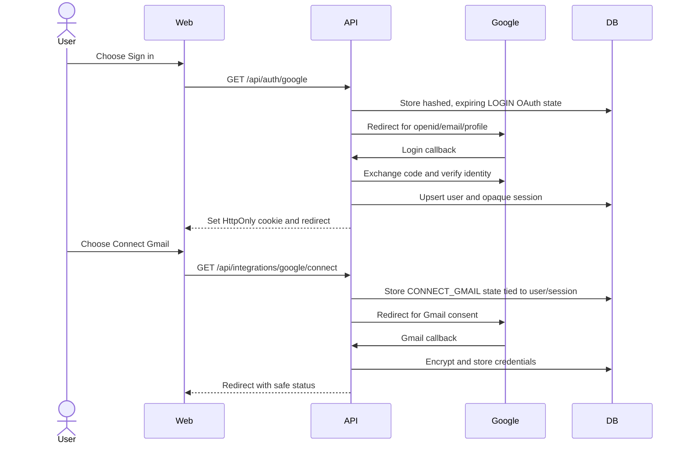
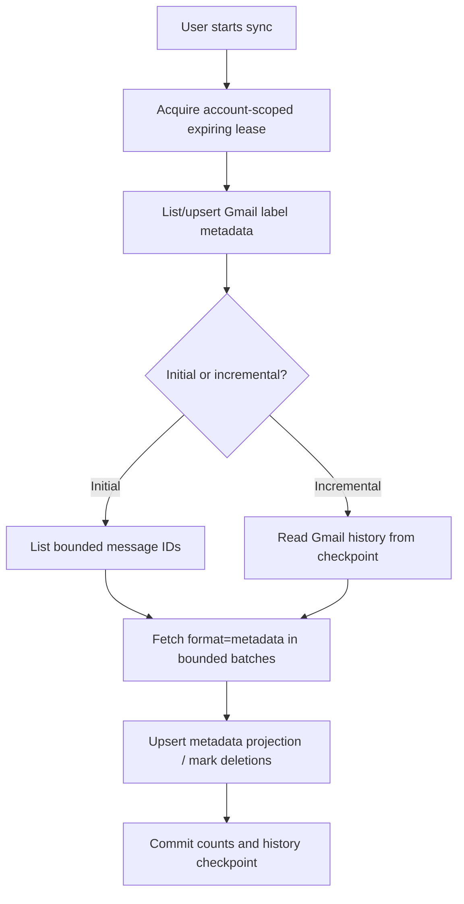

# MailMind AI architecture

## Context and goals

MailMind AI is a human-in-the-loop Gmail organization MVP. It securely separates identity login
from optional Gmail access, synchronizes a bounded metadata projection, produces explainable
classification recommendations, and proposes controlled label hierarchies for explicit user
review.

The current architecture prioritizes:

- No Gmail access as a side effect of signing in.
- No storage of full message bodies, raw MIME, or attachment content.
- No automatic mutation of Gmail messages from classification or discovery.
- Backend-only secrets and Google tokens.
- Account-scoped persistence, auditability, bounded work, and recoverable sync checkpoints.
- A deployable static frontend and a single stateless HTTP API backed by PostgreSQL.

## System view

Only the API crosses the PostgreSQL, Google, and classifier trust boundaries. The SPA receives
application DTOs and never receives OAuth tokens or service credentials.

## Monorepo boundaries

| Workspace             | Role                                                                                |
| --------------------- | ----------------------------------------------------------------------------------- |
| `apps/web`            | React SPA, protected navigation, user actions, and server-state presentation        |
| `apps/api`            | HTTP API, business rules, OAuth, Gmail sync, classification, discovery, persistence |
| `packages/shared`     | Application name, API prefix, shared types, and utilities                           |
| `packages/ui`         | Reusable React UI primitives                                                        |
| `packages/config`     | Shared TypeScript, ESLint, and Prettier configuration                               |
| `supabase/migrations` | Supabase-facing copies of the ordered SQL migrations                                |

The API follows a route/controller/service/repository layering convention:

Routes compose authentication, rate limits, and trusted-Origin checks. Controllers translate HTTP
input/output. Services enforce business and privacy rules. Repositories scope persistence to the
authenticated user’s connected account.

## Identity and Gmail authorization

Identity login and Gmail authorization are intentionally separate.

OAuth state is hashed, single-use, purpose-specific, and expiring. PKCE verifier material and
Google tokens are encrypted with AES-GCM-compatible ciphertext/IV/auth-tag fields and a stored key
version. Sessions use random opaque tokens; only their hashes are persisted.

Disconnect attempts Google credential revocation, clears stored token material, and retains a
disconnected account record for status and audit history.

## Gmail synchronization

The API uses the Gmail modify scope because the MVP can explicitly initialize the three managed
labels `MailMind`, `MailMind/Processed`, and `MailMind/Needs Review`. Message synchronization itself
is read-only.

Stored message data includes Gmail message/thread/history identifiers, selected headers, a
truncated snippet, label identifiers, dates, boolean state signals, estimated size, and attachment
presence. The API does not fetch or persist full bodies, raw MIME, or attachments.

An initial sync is bounded by configuration. Incremental sync uses Gmail history IDs and reports an
expired checkpoint as a recoverable requirement for another initial sync. Each sync type uses a
database lease to prevent overlapping work across API instances.

## Classification

Classification is a versioned recommendation pipeline over synchronized metadata:

1. Select eligible account-scoped messages.
2. Normalize and bound metadata input.
3. Evaluate deterministic rules.
4. Reuse an existing result when its input hash is unchanged.
5. Optionally call the configured external provider for unresolved cases.
6. Validate provider output against the fixed taxonomy.
7. Store confidence, explanation, reason codes, source, versions, and review status.
8. Store user corrections as immutable history.

Classifier output can recommend an action such as archive or unsubscribe, but it does not perform
that action. Provider calls occur outside database transactions and use bounded timeout/retry and
batch controls. The `mock` provider exists for deterministic tests; `disabled` supports rules-only
operation.

## Dynamic-label discovery

Discovery groups synchronized metadata using source, organization, topic, subscription, project,
and workflow signals. It applies public-suffix-aware normalization, agreement thresholds,
confidence scoring, caps, rediscovery suppression, and existing-label similarity checks.

Candidates live under a controlled `MailMind/...` hierarchy and have immutable decision history.
A user may approve, rename and approve, reject, defer, or merge a candidate. Approval currently
persists intent only: it returns `gmailLabelCreated: false`, and no Gmail message or label is
changed.

## Data architecture

The main relational groups are:

| Group                 | Tables                                                                                                                              |
| --------------------- | ----------------------------------------------------------------------------------------------------------------------------------- |
| Identity and security | `users`, `sessions`, `oauth_states`, `audit_logs`                                                                                   |
| Google connection     | `connected_google_accounts`                                                                                                         |
| Gmail projection      | `gmail_labels`, `gmail_message_metadata`, `gmail_sync_states`, `gmail_sync_runs`                                                    |
| Classification        | `classification_results`, `classification_states`, `classification_runs`, `user_classification_corrections`                         |
| Label discovery       | `dynamic_label_candidates`, `dynamic_label_candidate_messages`, `label_discovery_states`, `label_discovery_runs`, `label_decisions` |

State tables contain one account-scoped lease/checkpoint row. Run tables retain bounded operational
history. Results and decisions retain explainability and user intent. Foreign keys cascade
account-owned data, while merge targets use restrictive deletion semantics.

Database migrations enable and force RLS on application tables and remove direct table privileges
from `PUBLIC`, `anon`, and `authenticated`. The backend connects using its dedicated database role;
the browser does not query Supabase directly.

## Security architecture

- Exact frontend-origin CORS with credentials; no wildcard.
- Trusted-Origin validation on cookie-authenticated mutations.
- HttpOnly session cookie, Secure required in production, configurable SameSite and Domain.
- Matching attributes for cookie set and clear.
- OAuth state, PKCE, purpose binding, safe redirect paths, and separate callbacks.
- Encrypted Google token material with key versioning.
- Hashed session tokens and privacy-preserving IP handling.
- Helmet headers, 1 MiB request limits, endpoint-specific rate limits, and request IDs.
- Structured production logs with secret redaction.
- Generic 500 responses and safe readiness output.
- Forced RLS and least-privilege database grants.

## Runtime and deployment shape

The web application compiles to static files in `apps/web/dist`. The API compiles to Node.js ESM in
`apps/api/dist`, reads `PORT`, connects Prisma before listening, and handles graceful termination.
Liveness is independent of the database; readiness performs a database query with a five-second
timeout.

The API is stateless apart from PostgreSQL-backed sessions, OAuth state, checkpoints, and leases, so
multiple instances can share the database. Work is currently initiated by HTTP requests rather than
a background job system.

## Current boundaries and trade-offs

- One `WEB_APP_URL` is both the CORS allowlist and CSRF trusted origin. Multiple independent
  frontend origins are not currently supported.
- Sync, classification, and discovery run in request/response flows. Leases prevent overlap, but
  large-scale asynchronous work would require a queue/worker architecture.
- Gmail modify scope supports explicit managed-label creation, but classification and discovery do
  not mutate messages.
- The legal pages are placeholders in the current router, and `/support` and `/data-deletion` are
  not implemented.
- `API_BASE_URL` and both OAuth callback URIs are explicit configuration, keeping provider URLs out
  of source code.

See [Backend](backend.md), [Frontend](frontend.md), and [API reference](api.md) for implementation
details.
